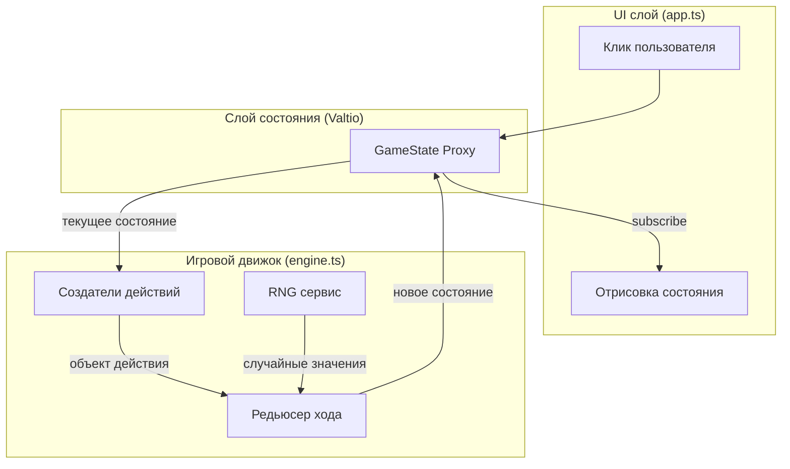

# Space Villain 3K - Тестируемая архитектура

## Принципы

1. **Чистый игровой движок** - вся логика в чистых функциях (вход → выход, без побочных эффектов) 2. **Внедрение зависимостей** - RNG инжектируется для детерминированных тестов
3. **Однонаправленный поток данных** - действия предсказуемо трансформируют состояние
4. **Разделение ответственности** - Игровые правила, управление состоянием и UI разделены

## Диаграмма архитектуры



## Структура модулей

```
src/
├── domain/           # Типы и интерфейсы
│   └── types.ts      # Entity, GameState, LogEntry, Action types
├── engine/           # Чистая игровая логика
│   ├── index.ts      # Основные экспорты
│   ├── actions.ts    # Создатели действий (attack, heal, charge, special)
│   ├── reducer.ts    # Редьюсер хода - обрабатывает ходы игрока и врага
│   ├── ai.ts         # Логика AI врага
│   └── rng.ts        # Генератор случайных чисел (инжектируемый)
├── state/            # Управление состоянием
│   └── store.ts      # Настройка Valtio proxy
├── ui/               # UI слой
│   ├── renderer.ts   # Функции отрисовки DOM
│   └── handlers.ts   # Обработчики событий
├── app.ts            # Инициализация приложения
└── main.ts           # Точка входа
```

## Ключевые архитектурные решения

### 1. Абстракция RNG

```typescript
// Для тестов: детерминированный
const deterministicRNG = { range: (min, max) => /* предсказуемый */ };

// Для игры: Math.random
const randomRNG = { range: (min, max) => Math.floor(Math.random() * (max - min + 1)) + min };
```

### 2. Паттерн Action

```typescript
type Action =
  | { type: 'PLAYER_ATTACK' }
  | { type: 'PLAYER_HEAL' }
  | { type: 'PLAYER_CHARGE' }
  | { type: 'PLAYER_SPECIAL' };

// Каждое действие возвращает TurnResult
type TurnResult = {
  newState: GameState;
  logs: LogEntry[];
  outcome: 'continue' | 'player_wins' | 'villain_wins';
};
```

### 3. Порядок хода (один вызов редьюсера)

```
Действие игрока
    ↓
Применение эффекта игрока (урон/лечение/энергия)
    ↓
Проверка смерти врага → Победа?
    ↓
Ход AI врага
    ↓
Проверка смерти игрока → Поражение?
    ↓
Возврат нового состояния + логов
```

### 4. Тестируемость

```typescript
// Пример теста
it('атака игрока наносит 4-8 урона и дает 2 энергии', () => {
  const rng = createDeterministicRNG([6, 2]); // урон=6, энергия=2
  const initial = createInitialState();

  const result = processTurn(initial, { type: 'PLAYER_ATTACK' }, rng);

  expect(result.newState.villain.health).toBe(initial.villain.health - 6);
  expect(result.newState.player.energy).toBe(initial.player.energy + 2);
  expect(result.logs).toContainEqual({ message: 'Вы наносите удар на 6 урона!' });
});
```

## Типы данных

```typescript
interface Entity {
  hp: number;
  maxHp: number;
  energy: number;
  maxEnergy: number;
  attackPower: number;
  healPower: number;
}

interface GameState {
  player: Entity;
  villain: Entity;
  log: LogEntry[];
  turn: number;
  status: 'playing' | 'player_won' | 'villain_won';
}

interface LogEntry {
  turn: number;
  actor: 'player' | 'villain';
  action: string;
  value?: number;
  message: string;
}
```

## Стоимость и эффекты действий (из TODO)

| Действие | Стоимость | Эффект |
|----------|-----------|--------|
| Attack | 0 | 4-8 урона врагу, +2 энергии |
| Heal | 3 энергии | 6-10 HP игроку (с ограничением максимума) |
| Charge | 0 | +6-10 энергии |
| Special | 10 энергии | 10-20 урона врагу |

## AI врага

```typescript
// Простой AI: атакует, пока HP >= 50%, иначе 50% шанс полечиться
function villainAI(state: GameState, rng: RNG): VillainAction {
  const hpPercent = state.villain.hp / state.villain.maxHp;

  if (hpPercent < 0.5 && rng.chance(0.5)) {
    return { type: 'HEAL', amount: rng.range(5, 10) };
  }

  // Обычная атака с критом/промахом
  const roll = rng.range(1, 100);
  if (roll <= 10) return { type: 'MISS' };
  if (roll <= 25) return { type: 'CRIT', damage: rng.range(5, 12) * 2 };
  return { type: 'ATTACK', damage: rng.range(5, 12) };
}
```

## Преимущества архитектуры

1. **100% тестируемость** - вся игровая логика в чистых функциях
2. **Детерминированность** - одинаковые входы всегда дают одинаковые выходы (с seeded RNG)
3. **Отлаживаемость** - можно воспроизвести точные состояния игры
4. **Поддерживаемость** - четкое разделение, легко добавлять новые действия
5. **Time-travel** - можно отменить/повторить ходы, храня историю состояний
